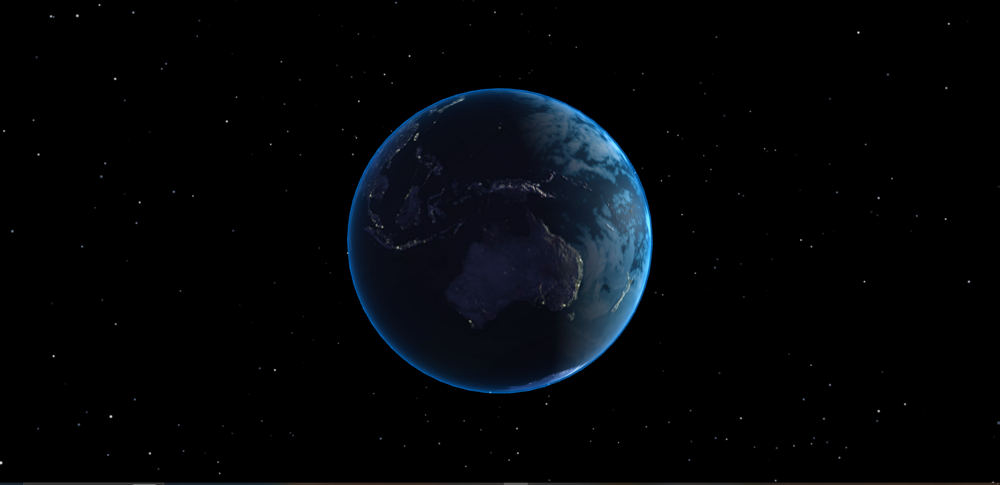

# Earth-in-ThreeJS

Earth-in-ThreeJS is an immersive 3D visualization of Earth, built using the Three.js library. It was a fun project in which I got to test out some of my skills in ThreeJS.

You can explore the deployed version of Earth-in-ThreeJS here:

[https://earth-in-three-js.vercel.app/
](https://earth-in-three-js.vercel.app/)

## 📋 Table of Contents

1. 🚀 [Introduction](#Earth-in-ThreeJS)
2. 🎓 [What I Learned](#What-I-Learned)
3. ⚙️ [Technologies Used](#Technologies-Used)
4. 🛠️ [How to run Earth-in-ThreeJS](#How-to-run-Earth-in-ThreeJS)
5. 📁 [Project Structure](#Project-Structure)
6. 🌟 [Features](#Features)
7. 🙌 [Acknowledgements](#Acknowledgements)
8. 🚀 [About Me](#About-Me)
9. 🔗 [Links](#-Links)

## <a name="What-I-Learned">What I Learned</a>

- Mastering Three.js for 3D web visualizations.
- Implementing realistic lighting and textures to simulate environmental effects.
- Optimising web applications for performance and responsiveness.
- Creating and managing complex 3D scenes with multiple objects and effects.
- Utilising shader materials for advanced visual effects, such as atmospheric glow.

## <a name="Technologies-Used">Technologies Used</a>

- Three.js for 3D modeling and rendering.
- JavaScript for scripting and interaction.
- HTML & CSS for structure and styling.
- Vercel for deployment and hosting.

## <a name="How-to-run-Earth-in-ThreeJS">How to run Earth-in-ThreeJS</a>

### Prerequisites

- Node.js

### Installation

1. Clone the repository:

   `git clone https://github.com/tim-mclennan/Earth-in-ThreeJS`

2. Install NPM packages:

    `npm install`

### Running the Application

   `npm start`

The application will be available on `http://localhost:3000` by default.

## <a name="Project-Structure">Project Structure</a>

The project is structured to facilitate easy development and maintenance. Key directories include:

- `src/`: Contains the JavaScript modules for the Earth visualization, including the main scene setup, lighting, textures, and effects.
- `textures/`: Stores the texture images used for the Earth's surface, clouds, and night lights.
- `public/`: Contains the static files such as `index.html` and the entry point `index.js`.

## <a name="Features">Features</a>

Earth-in-ThreeJS offers a range of features to explore the Earth in 3D:

- **Interactive Rotation**: Users can rotate the Earth to view it from different angles.
- **Zoom**: Zoom in and out to get a closer look at specific regions.
- **Day/Night Cycle**: Simulates the Earth's rotation with a day/night cycle.
- **Clouds and Atmospheric Effects**: Realistic clouds and atmospheric glow effects.
- **Starfield Background**: A dynamic starfield adds depth to the scene.

## <a name="Acknowledgements">Acknowledgements</a>

- Three.js
- The Three.js community for valuable resources and examples.

## <a name="About-Me">🚀 About Me</a>
I'm a developer passionate about 3D web technologies and creating immersive experiences.

## <a name="Links">🔗 Links</a>

